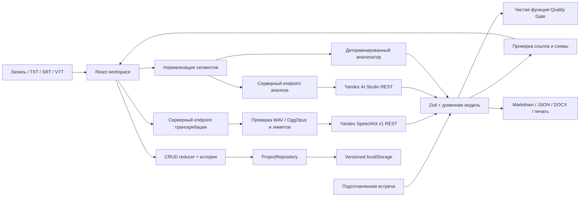

# Архитектура

## Компоненты и поток данных

`src/domain` содержит модель, Zod-схемы, проверку ссылок, reducer и Quality Gate. `src/services` содержит анализ текста, импорт, хранилище, экспорт и клиентские обращения к API. `server` содержит реализацию AI-провайдеров и HTTP-обработку. `api` — тонкие точки входа Vercel. Интерфейс в `src/app` и `src/features` использует те же доменные объекты во всех режимах.

Импорт сначала проверяет размер и тип файла. SRT/VTT сохраняют точные таймкоды. Для обычного текста интервалы оцениваются по длине и помечаются как приблизительные: это не доказательство точного времени записи. Детерминированный анализатор использует явные маркеры, не извлекает роли и сценарии без достаточного контекста и выставляет низкую уверенность. Демо использует подготовленные данные, а не имитирует работу модели.

AI-анализ получает только нормализованные сегменты как недоверенные данные. Структурированный ответ валидируется Zod, затем проверяется целостность ссылок. Цитаты, говорящие и время берутся из исходного сегмента по ID. Все автоматически созданные элементы остаются черновиками. При некорректном ответе выполняется один повтор с указанием необходимости исправить схему и ссылки. Ошибка не заменяет существующий проект.

`YandexProvider` использует нативный `fetch` с фиксированными endpoint, серверным API-ключом, запретом редиректов, таймаутом и безопасными кодами ошибок. `server/audio.ts` проверяет WAV PCM mono и OggOpus mono, размер до 1 000 000 байт и длительность до 30 секунд. SpeechKit v1 не даёт временного выравнивания текста: весь ответ сохраняется одним сегментом с `timing: estimated`. Это блокирует точную навигацию к реплике; длительность самого файла вычисляется из аудиоконтейнера. Исходники с точными таймкодами не меняются.

Успешное распознавание сохраняется в репозитории до запроса анализа. Сбой анализа сохраняет транскрипцию для повторного анализа без повторного распознавания. Отмена и проверка версии проекта защищают от применения устаревшего ответа.

`src/domain/transcription.ts` определяет лимиты, `TranscriptionJob` и будущий `AsyncTranscriptionProvider`. Реализации очереди нет: `mode: async` возвращает 501, а превышение синхронных лимитов — 413 до облачного запроса. Подробный следующий этап: [ASYNC_TRANSCRIPTION](ASYNC_TRANSCRIPTION.md).

## Хранилище и изменения

Выбран versioned localStorage: объём текстовых проектов невелик, синхронное сохранение упрощает гарантии UI. Оболочка `{version: 1, projects: [...]}` проверяется при чтении. Неизвестная версия и повреждение показывают восстановление; данные не перезаписываются молча. Между вкладками отслеживаются изменения хранилища, чтобы не затереть чужую правку. Большие Blob и секреты не сохраняются. После перезагрузки для воспроизведения нужно заново выбрать исходную запись.

Удаление требования очищает ссылки из сценариев и конфликтов; сегменты сохраняются. Отмена восстанавливает снимок до удаления. При следующей правке кнопка отмены исчезает, чтобы старый снимок не затёр новые изменения. Хранится до 30 записей истории.

`ProjectRepository` можно заменить HTTP-адаптером без изменения формулы качества и экспортов. Для новой версии схемы нужна явная миграция; универсальная миграция неизвестных форматов намеренно не выполняется.

## Quality Gate

Из расчёта исключены отклонённые элементы. Для источников и критериев учитываются все оставшиеся элементы, кроме открытых вопросов. Формула: 30 × доля с источником + 25 × доля с критериями + 20 × доля элементов без необходимости уточнения + 15 при отсутствии открытых конфликтов + 10 при наличии роли и сценария. Неутверждённый открытый вопрос считается требующим уточнения. Пустой документ получает 0. Результат округляется и ограничивается 0–100. Формула измеряет комплектность, не семантическую корректность и не готовность к промышленной эксплуатации.

## Компромиссы

Без серверной БД, аккаунтов и совместного редактирования. Конфликты автоматически выделены в учебном примере и могут извлекаться AI; локальный маркерный анализатор не заявляет семантического обнаружения конфликтов. Плеер не извлекает аудио из неподдерживаемого видео. Нет очереди фоновых задач и разбиения многочасовых записей. Сервис-воркер кеширует оболочку приложения, но не API и приватные записи. Эти ограничения позволяют показать надёжный основной сценарий и расширять его через адаптеры.
